# Multi-Tenant PMS Scheduler — Full Architecture Diagram

```mermaid
flowchart TD
    classDef client    fill:#4A90D9,stroke:#2C5F8A,color:#fff
    classDef apigw     fill:#E8761A,stroke:#B35A13,color:#fff
    classDef lambda    fill:#FF9900,stroke:#CC7A00,color:#000
    classDef db        fill:#3B48CC,stroke:#2A3599,color:#fff
    classDef eb        fill:#E7157B,stroke:#B50F5F,color:#fff
    classDef sqs       fill:#FF4F8B,stroke:#CC3A6E,color:#fff
    classDef external  fill:#1A9E3F,stroke:#126B2B,color:#fff
    classDef iam       fill:#DD344C,stroke:#A82438,color:#fff
    classDef cw        fill:#7B42BC,stroke:#5C3190,color:#fff
    classDef s3        fill:#3F8624,stroke:#2D601A,color:#fff

    %% ── CLIENT ────────────────────────────────────────────────────────────────
    CLIENT(["Client\ncurl / PMS UI / HTTP tool"]):::client

    %% ── API GATEWAY ───────────────────────────────────────────────────────────
    subgraph APIGW["API Gateway HTTP v2"]
        direction TB
        AG1["POST   /tenants"]
        AG2["GET    /tenants"]
        AG3["GET    /tenants/{id}"]
        AG4["PUT    /tenants/{id}/schedule"]
        AG5["DELETE /tenants/{id}"]
        AG6["GET    /health"]
    end

    CLIENT -->|"HTTPS request"| APIGW

    %% ── API LAMBDA ────────────────────────────────────────────────────────────
    subgraph APIL["API Lambda — pms-api  ·  256 MB  ·  30 s timeout  ·  provided.al2023"]
        direction TB

        subgraph AINIT["init()  — cold start only"]
            AI1["db.Connect()\nsql.Open pgx driver\nconn.Ping()"]
            AI2["db.Migrate()\nCREATE TABLE IF NOT EXISTS tenant_config\nALTER TABLE ADD COLUMN IF NOT EXISTS schedule_type\nALTER TABLE ADD COLUMN IF NOT EXISTS rate_minutes"]
            AI1 --> AI2
        end

        subgraph AHAND["handler(ctx, APIGatewayV2HTTPRequest)"]
            direction TB
            AV["validateSchedule(scheduleType, timezone, runTime, rateMinutes)\ndaily → require timezone + runTime\nrate  → require rateMinutes > 0"]

            AR1["POST /tenants\ndb.CreateTenant(ctx, tenant)\nsched.Upsert(ctx, tenantID, scheduleType,\n  timezone, runTime, rateMinutes)"]

            AR2["GET /tenants\ndb.ListTenants(ctx)\nSELECT * FROM tenant_config ORDER BY tenant_id"]

            AR3["GET /tenants/{id}\ndb.GetTenant(ctx, tenantID)\nSELECT * FROM tenant_config WHERE tenant_id=$1"]

            AR4["PUT /tenants/{id}/schedule\ndb.UpdateTenantSchedule(ctx, tenantID, scheduleType,\n  timezone, runTime, rateMinutes, enabled)\nenabled=true  → sched.Upsert()\nenabled=false → sched.Disable()"]

            AR5["DELETE /tenants/{id}\ndb.DeleteTenant(ctx, tenantID)\nsched.Delete(ctx, tenantID)"]

            AR6["GET /health\ndb.Ping(ctx)\n200 OK  →  {status: ok}\n503     →  {error: database unavailable}"]

            AV --> AR1 & AR4
        end
    end

    APIGW -->|"Lambda Proxy\nIntegration"| APIL

    %% ── SCHEDULER PACKAGE ─────────────────────────────────────────────────────
    subgraph SCHPKG["internal/scheduler  —  Scheduler Package"]
        direction TB

        SB["buildExpression(scheduleType, timezone, runTime, rateMinutes)\n───────────────────────────────────────────────\ndaily  →  cron(MM HH * * ? *)  +  tz = tenant timezone\nrate   →  rate(N hour/s)       +  tz = UTC  (ignored by AWS for rate)"]

        SU["Upsert(ctx, tenantID, scheduleType, timezone, runTime, rateMinutes)\n───────────────────────────────────────────────\n1. buildExpression() → expr, tz\n2. UpdateSchedule(Name, GroupName, Expression, Timezone, Target)\n   success  → return nil\n   ResourceNotFoundException  → fall through\n3. CreateSchedule(same params)"]

        SD["Disable(ctx, tenantID)\n───────────────────────────────────────────────\n1. GetSchedule(Name, GroupName)\n   → fetches current Expression + Target\n2. UpdateSchedule(State = DISABLED)\n   preserves expression, changes state only"]

        SDEL["Delete(ctx, tenantID)\n───────────────────────────────────────────────\nDeleteSchedule(Name, GroupName)\nResourceNotFoundException  → no-op  (idempotent)"]

        SB --> SU
    end

    APIL -->|"Upsert / Disable / Delete\ncalls"| SCHPKG

    %% ── RDS ───────────────────────────────────────────────────────────────────
    subgraph RDSBOX["RDS PostgreSQL 15  —  db.t3.micro  ·  20 GB gp2  ·  single-AZ"]
        TABLE[("tenant_config\n══════════════════════════════\ntenant_id     VARCHAR(50)   PK\nname          VARCHAR(255)\nschedule_type VARCHAR(10)   DEFAULT 'daily'\ntimezone      VARCHAR(100)  DEFAULT 'UTC'\nrun_time      VARCHAR(5)    DEFAULT ''\nrate_minutes  INT           DEFAULT 0\nenabled       BOOLEAN\nlatitude      DECIMAL(9,6)\nlongitude     DECIMAL(9,6)\nhotel_code    VARCHAR(50)\ncreated_at    TIMESTAMPTZ\nupdated_at    TIMESTAMPTZ")]:::db
    end

    APIL  -->|"CreateTenant\nListTenants\nGetTenant\nUpdateTenantSchedule\nDeleteTenant\nPing"| TABLE
    SCHPKG -->|"scheduler state\nis derived from\nthis table"| TABLE

    %% ── IAM ───────────────────────────────────────────────────────────────────
    subgraph IAMBOX["IAM Roles"]
        direction TB
        IAM1["pms-api-lambda-role\nAssumed by: lambda.amazonaws.com\n──────────────────────\nscheduler:CreateSchedule\nscheduler:UpdateSchedule\nscheduler:GetSchedule\nscheduler:DeleteSchedule\nscheduler:ListSchedules\niam:PassRole → execution-role only\nlogs:CreateLogGroup\nlogs:CreateLogStream\nlogs:PutLogEvents"]:::iam

        IAM2["pms-scheduler-execution-role\nAssumed by: scheduler.amazonaws.com\n──────────────────────\nlambda:InvokeFunction\n→ pms-trigger ARN only"]:::iam

        IAM3["pms-trigger-lambda-role\nAssumed by: lambda.amazonaws.com\n──────────────────────\nsqs:SendMessage → pms-queue ARN only\nsqs:GetQueueAttributes\nlogs:CreateLogGroup\nlogs:CreateLogStream\nlogs:PutLogEvents"]:::iam
    end

    APIL  -. "assumes\npms-api-lambda-role" .-> IAM1
    SCHPKG -->|"iam:PassRole required\nto hand role to EventBridge\nwhen calling CreateSchedule"| IAM2

    %% ── EVENTBRIDGE ───────────────────────────────────────────────────────────
    subgraph EBGROUP["EventBridge Scheduler Group — pms-schedulers"]
        direction TB
        EB1["tenant-tenant-001\nExpression : cron(0 7 * * ? *)\nTimezone   : Asia/Kolkata  ← DST-aware\nState      : ENABLED\nTarget ARN : pms-trigger Lambda\nInput      : {tenantId: 'tenant-001'}"]:::eb

        EB2["tenant-tenant-002\nExpression : cron(0 9 * * ? *)\nTimezone   : America/New_York  ← DST-aware\nState      : ENABLED\nInput      : {tenantId: 'tenant-002'}"]:::eb

        EB3["tenant-tenant-NNN  (rate example)\nExpression : rate(1 hour)\nTimezone   : UTC  (ignored for rate)\nState      : ENABLED\nInput      : {tenantId: 'tenant-NNN'}"]:::eb
    end

    SCHPKG -->|"CreateSchedule\nUpdateSchedule\nDeleteSchedule\nvia AWS SDK"| EBGROUP

    %% ── TRIGGER LAMBDA ────────────────────────────────────────────────────────
    subgraph TRIGL["Trigger Lambda — pms-trigger  ·  256 MB  ·  60 s timeout  ·  provided.al2023"]
        direction TB

        subgraph TINIT["init()  — cold start only"]
            TI1["db.Connect()"]
            TI2["config.LoadDefaultConfig()\nsqs.NewFromConfig(cfg)\n→ sqsClient (package-level var)"]
            TI1 --> TI2
        end

        subgraph THAND["handler(ctx, TriggerEvent{TenantID string})"]
            direction TB
            T1["Step 1 — db.GetTenant(ctx, event.TenantID)\nSELECT from tenant_config\nreturns hotelCode, latitude, longitude,\ntimezone, runTime, scheduleType"]

            T2["Step 2 — fetchWeather(lat, lon)\nhttp.Get(open-meteo URL)\nDecodes: temperature_2m, wind_speed_10m,\nweather_code from JSON response"]

            T3["Step 3 — sqsClient.SendMessage(ctx, input)\nQueueUrl  : SQS_QUEUE_URL env var\nBody      : JSON{tenantId, hotelCode,\n             executedAt, weatherData}\nMessageAttribute: tenantId (String)"]

            T1 --> T2 --> T3
        end
    end

    EBGROUP -->|"Fires at scheduled time\nAssumes pms-scheduler-execution-role\nInvokes with Input payload\n{tenantId: 'tenant-NNN'}"| TRIGL
    IAM2 -. "grants\nlambda:InvokeFunction" .-> TRIGL

    TRIGL -->|"db.GetTenant\nvia same pgx/v5\nconnection pool"| TABLE

    %% ── OPEN-METEO ────────────────────────────────────────────────────────────
    OPENMETEO(["Open-Meteo API\napi.open-meteo.com/v1/forecast\n?latitude=...\n&longitude=...\n&current=temperature_2m,\nwind_speed_10m,weather_code\n&forecast_days=1\n\nSubstitute for OHIP API\nNo API key required"]):::external

    TRIGL -->|"fetchWeather(lat, lon)\nHTTP GET"| OPENMETEO
    OPENMETEO -->|"JSON response\n{current:{temperature_2m,\nwind_speed_10m, weather_code}}"| TRIGL

    %% ── SQS ───────────────────────────────────────────────────────────────────
    subgraph SQSBOX["Amazon SQS"]
        direction TB
        SQSQ["pms-queue  (Standard Queue)\nMessage body: JSON payload\n{tenantId, hotelCode, executedAt,\nweatherData{latitude, longitude,\ncurrent{temperature_2m,\nwind_speed_10m, weather_code}}}\nMessageAttribute: tenantId"]:::sqs

        SQSDLQ["pms-dlq  (Dead Letter Queue)\nReceives messages after\nmaxReceiveCount = 3 failed deliveries\nMonitor ApproximateNumberOfMessages\nfor ops alerting"]:::sqs

        SQSQ -->|"3 failed\ndeliveries"| SQSDLQ
    end

    TRIGL  -->|"sqsClient.SendMessage()\nIAM: sqs:SendMessage"| SQSQ
    IAM3 -. "grants\nsqs:SendMessage" .-> SQSQ

    %% ── CONSUMERS ─────────────────────────────────────────────────────────────
    CONSUMERS(["Downstream Consumers\nAny SQS subscriber\ne.g. another Lambda,\nECS task, data pipeline"]):::client
    SQSQ -->|"SQS long-poll\nor event-source mapping"| CONSUMERS

    %% ── CLOUDWATCH ────────────────────────────────────────────────────────────
    subgraph CWBOX["CloudWatch Logs"]
        direction LR
        CW1["/aws/lambda/pms-api\nretention: 30 days\nformat: JSON slog\nkey fields: requestId, method,\npath, status, durationMs"]:::cw

        CW2["/aws/lambda/pms-trigger\nretention: 30 days\nformat: JSON slog\nkey fields: tenantId, hotelCode,\ntemperature, windSpeed,\nsqsMessageId, durationMs"]:::cw
    end

    APIL  -->|"JSON structured\nlogs via slog"| CW1
    TRIGL -->|"JSON structured\nlogs via slog"| CW2

    %% ── S3 ────────────────────────────────────────────────────────────────────
    S3BUCK["S3 Bucket\npms-lambda-{accountId}\napi.zip   — API Lambda binary\ntrigger.zip — Trigger Lambda binary\nUploaded by: make upload\nReferenced by Terraform\nsource_code_hash for change detection"]:::s3

    S3BUCK -->|"s3_bucket + s3_key\nsource_code_hash"| APIL
    S3BUCK -->|"s3_bucket + s3_key\nsource_code_hash"| TRIGL
```



---

## Component Reference

### Client
Any HTTP client — curl, Postman, or a PMS front-end. Sends requests to the API Gateway base URL obtained from `terraform output api_endpoint`.

---

### API Gateway HTTP v2
Receives all inbound HTTPS requests. Configured as a Lambda proxy integration — it forwards the full request (method, path, headers, body) to the API Lambda and returns whatever the Lambda responds with. No routing logic lives in API Gateway; everything is handled inside the Lambda.

---

### API Lambda (`pms-api`)

**`init()` — runs once per cold start:**
- `db.Connect()` — opens a PostgreSQL connection using the `DB_DSN` environment variable via the `pgx/v5/stdlib` driver.
- `db.Migrate()` — runs `CREATE TABLE IF NOT EXISTS` and `ALTER TABLE ADD COLUMN IF NOT EXISTS` to ensure the schema is current. Idempotent — safe to run on every cold start.

**`handler(ctx, req)` — runs on every request:**
- Parses method + path, extracts `tenantID` from path segments.
- `validateSchedule()` — checks `scheduleType` is `"daily"` or `"rate"`, and that the correct complementary fields are present.
- Routes to the matching DB + scheduler call pair.
- Every log line carries the API Gateway `requestId` for tracing across log streams.

---

### internal/scheduler Package

**`buildExpression()`** translates the stored DB fields into an EventBridge expression:
- `daily` → `cron(MM HH * * ? *)` with the tenant's IANA timezone. AWS interprets the cron in that timezone and handles DST automatically.
- `rate` → `rate(N hour/s)` or `rate(N minute/s)`. Timezone is set to `UTC` (EventBridge ignores it for rate expressions).

**`Upsert()`** is the hot-path write. It tries `UpdateSchedule` first (cheaper — no existence check). Only on `ResourceNotFoundException` does it fall back to `CreateSchedule`. This avoids a `GetSchedule` round-trip on every tenant update.

**`Disable()`** must call `GetSchedule` first because `UpdateSchedule` is a full replacement (not a partial update) — it needs the existing expression and target to resubmit alongside `State=DISABLED`.

**`Delete()`** calls `DeleteSchedule` and silently ignores `ResourceNotFoundException` so it is safe to call on tenants whose scheduler was already removed.

---

### RDS PostgreSQL (`tenant_config`)
The single source of truth. Schedulers are derived resources — they can be deleted and recreated from this table at any time without data loss. The two key columns added for rate scheduling:
- `schedule_type` — `"daily"` or `"rate"`. Defaults to `"daily"` so existing rows are unaffected by the migration.
- `rate_minutes` — the interval in minutes. `60` = every hour, `120` = every 2 hours. `0` for daily tenants.

---

### IAM Roles

**`pms-api-lambda-role`** — used by the API Lambda. Has `iam:PassRole` scoped to `pms-scheduler-execution-role` only. This is required because when the API Lambda calls `CreateSchedule`, it must hand EventBridge a role ARN to assume at fire time. AWS enforces that the caller holds `PassRole` on that specific role before it can delegate it.

**`pms-scheduler-execution-role`** — assumed by EventBridge Scheduler (not by any Lambda directly). Grants only `lambda:InvokeFunction` on the Trigger Lambda ARN. Least-privilege: EventBridge can do nothing else in the account.

**`pms-trigger-lambda-role`** — used by the Trigger Lambda. Grants `sqs:SendMessage` scoped to the `pms-queue` ARN only.

---

### EventBridge Scheduler Group (`pms-schedulers`)

One scheduler per tenant, created at `POST /tenants` time and updated on every `PUT /tenants/{id}/schedule`. Each scheduler stores:
- The tenant ID embedded in the `Input` JSON (`{"tenantId":"tenant-001"}`). This is the exact payload the Trigger Lambda receives as its event.
- The schedule expression (`cron(...)` or `rate(...)`).
- The timezone (for cron schedules — AWS handles DST automatically).
- The `RoleArn` the scheduler assumes to invoke the Lambda.

AWS supports up to 1,000,000 schedulers per account. Adding tenants is entirely application-level — no Terraform changes needed.

---

### Trigger Lambda (`pms-trigger`)

Invoked by EventBridge. Receives `{"tenantId":"tenant-001"}` as the event.

**Step 1 — `db.GetTenant(ctx, event.TenantID)`**: Loads the full tenant row including `hotelCode`, `latitude`, `longitude`, `timezone`. The Lambda does not need to know the schedule type or run time — it only needs to know *who* it's running for.

**Step 2 — `fetchWeather(lat, lon)`**: Makes an HTTP GET to Open-Meteo. In a production PMS system, this step would call the OHIP API using `hotelCode` instead.

**Step 3 — `sqsClient.SendMessage()`**: Pushes the combined payload (tenant metadata + weather data) to `pms-queue`. Includes a `tenantId` MessageAttribute so downstream consumers can filter by tenant without deserialising the body.

---

### Open-Meteo API
A free, open-source weather API used here as a substitute for the OHIP property management API. No API key required. Returns current temperature, wind speed, and weather code for a latitude/longitude coordinate. In production, replace `fetchWeather()` with an OHIP API call using `hotelCode`.

---

### Amazon SQS (`pms-queue` + `pms-dlq`)

`pms-queue` buffers the Trigger Lambda output for async downstream processing. `pms-dlq` receives messages that fail delivery 3 times (`maxReceiveCount=3`). Monitor `ApproximateNumberOfMessages` on the DLQ — any value above 0 means a tenant's job failed all retries and needs investigation.

---

### CloudWatch Logs

Both Lambdas use Go's `log/slog` with `JSONHandler`. Every log line is a single JSON object. The API Lambda adds `requestId` (from API Gateway) to every line so all log entries for one HTTP request can be found with a single filter:

```
{ $.requestId = "abc-123-def" }
```

The Trigger Lambda adds `tenantId` to every line so all activity for one tenant can be found with:

```
{ $.tenantId = "tenant-001" }
```

---

### S3 Bucket (`pms-lambda-{accountId}`)
Holds the two Lambda deployment zips. Using S3 instead of direct upload avoids the base64 HTTP body size limit that causes the Lambda API to hang on files over ~5 MB. Terraform references the zips via `s3_bucket` + `s3_key` and detects code changes via `source_code_hash = filebase64sha256(...)` evaluated at plan time.
