# Multi-Tenant PMS Scheduler — Full Architecture Diagram

```mermaid
flowchart TD
    classDef client    fill:#4A90D9,stroke:#2C5F8A,color:#fff
    classDef apigw     fill:#E8761A,stroke:#B35A13,color:#fff
    classDef lambda    fill:#FF9900,stroke:#CC7A00,color:#000
    classDef db        fill:#3B48CC,stroke:#2A3599,color:#fff
    classDef eb        fill:#E7157B,stroke:#B50F5F,color:#fff
    classDef sqs       fill:#FF4F8B,stroke:#CC3A6E,color:#fff
    classDef iam       fill:#DD344C,stroke:#A82438,color:#fff
    classDef cw        fill:#7B42BC,stroke:#5C3190,color:#fff
    classDef s3        fill:#3F8624,stroke:#2D601A,color:#fff

    %% ── CLIENT ────────────────────────────────────────────────────────────────
    CLIENT(["Client\ncurl / PMS UI / HTTP tool"]):::client

    %% ── API GATEWAY ───────────────────────────────────────────────────────────
    subgraph APIGW["API Gateway HTTP v2"]
        direction TB
        AG1["POST   /tenants"]
        AG2["GET    /tenants"]
        AG3["GET    /tenants/{id}"]
        AG4["PUT    /tenants/{id}/schedule"]
        AG5["PUT    /tenants/{id}/config"]
        AG6["DELETE /tenants/{id}"]
        AG7["GET    /health"]
    end

    CLIENT -->|"HTTPS request"| APIGW

    %% ── API LAMBDA ────────────────────────────────────────────────────────────
    subgraph APIL["API Lambda — pms-api  ·  256 MB  ·  30 s timeout  ·  provided.al2023"]
        direction TB

        subgraph AINIT["init()  — cold start only"]
            AI1["db.Connect()\nsql.Open pgx driver\nconn.Ping()"]
            AI2["db.Migrate()\nDROP TABLE IF EXISTS tenant_config CASCADE\nCREATE TABLE IF NOT EXISTS tenant\n  (tenant_id, pms_provider, config JSONB, ...)\n(idempotent)"]
            AI1 --> AI2
        end

        subgraph AHAND["handler(ctx, APIGatewayV2HTTPRequest)"]
            direction TB

            AR1["POST /tenants\n1. sched.Upsert(tenantID, expression, timezone, enabled)\n   → CreateSchedule in pms-schedulers group\n2. db.CreateTenant(tenantID, pmsProvider, config)\n   → INSERT INTO tenant (single row, config JSONB included)\n   Rollback: sched.Delete on DB failure"]

            AR2["GET /tenants\ndb.ListTenants(ctx)\nSELECT tenant_id, pms_provider, config, created_at FROM tenant\n(identity + config — NO schedule)"]

            AR3["GET /tenants/{id}\ndb.GetTenant(ctx, tenantID)\n→ SELECT from tenant (single table, no join)\nsched.Get(ctx, tenantID)\n→ EventBridge GetSchedule (live read)\nreturns identity + config + schedule"]

            AR4["PUT /tenants/{id}/schedule\ndb.GetTenant() → existence check only\nsched.Upsert(tenantID, expression, timezone, enabled)\n→ UpdateSchedule (fallback CreateSchedule)\nNO DB WRITE"]

            AR5["PUT /tenants/{id}/config\ndb.GetTenant() → existence check only\ndb.UpdateConfig(tenantID, config)\n→ UPDATE tenant SET config = $2, updated_at = NOW()\nNO EVENTBRIDGE CALL"]

            AR6["DELETE /tenants/{id}\ndb.GetTenant() → existence check\ndb.DeleteTenant()\n→ DELETE FROM tenant WHERE tenant_id = $1\nsched.Delete(tenantID)"]

            AR7["GET /health\ndb.Ping(ctx)\n200 → {status: ok}\n503 → {error: database unavailable}"]
        end
    end

    APIGW -->|"Lambda Proxy\nIntegration"| APIL

    %% ── SCHEDULER PACKAGE ─────────────────────────────────────────────────────
    subgraph SCHPKG["internal/scheduler  —  Scheduler Package"]
        direction TB

        SGET["Get(tenantID)\n───────────────────────────────────────────────\nGetSchedule(Name=tenantID, GroupName)\n→ returns ScheduleInfo{Expression, Timezone, State}\nResourceNotFoundException → return nil (not found)"]

        SU["Upsert(tenantID, expression, timezone, enabled)\n───────────────────────────────────────────────\nstate = ENABLED if enabled else DISABLED\npayload = {tenantId: tenantID}\n1. UpdateSchedule(Name=tenantID, ...)\n   success  → return nil\n   ResourceNotFoundException  → fall through\n2. CreateSchedule(same params)"]

        SDEL["Delete(tenantID)\n───────────────────────────────────────────────\nDeleteSchedule(Name=tenantID, GroupName)\nResourceNotFoundException  → no-op  (idempotent)"]
    end

    APIL -->|"Get / Upsert / Delete\ncalls"| SCHPKG

    %% ── RDS ───────────────────────────────────────────────────────────────────
    subgraph RDSBOX["RDS PostgreSQL 15  —  db.t3.micro  ·  20 GB gp2  ·  single-AZ"]
        direction TB
        TENANT[("tenant\n══════════════════════════════\ntenant_id     VARCHAR(50)   PK\npms_provider  VARCHAR(100)  NOT NULL\nconfig        JSONB  NOT NULL  DEFAULT '{}'\n  Arbitrary non-schedule metadata:\n  { name, hotelCode, region, ... }\n  NO expression / timezone / enabled\ncreated_at    TIMESTAMPTZ\nupdated_at    TIMESTAMPTZ")]:::db
    end

    APIL  -->|"CreateTenant\nListTenants\nGetTenant\nUpdateConfig\nDeleteTenant\nPing"| RDSBOX

    %% ── IAM ───────────────────────────────────────────────────────────────────
    subgraph IAMBOX["IAM Roles"]
        direction TB
        IAM1["pms-api-lambda-role\nAssumed by: lambda.amazonaws.com\n──────────────────────\nscheduler:CreateSchedule\nscheduler:UpdateSchedule\nscheduler:GetSchedule\nscheduler:DeleteSchedule\nscheduler:ListSchedules\niam:PassRole → execution-role only\nlogs:*"]:::iam

        IAM2["pms-scheduler-execution-role\nAssumed by: scheduler.amazonaws.com\n──────────────────────\nlambda:InvokeFunction\n→ pms-trigger ARN only"]:::iam

        IAM3["pms-trigger-lambda-role\nAssumed by: lambda.amazonaws.com\n──────────────────────\nsqs:SendMessage → pms-queue ARN only\nsqs:GetQueueAttributes\nlogs:*"]:::iam
    end

    APIL  -. "assumes\npms-api-lambda-role" .-> IAM1
    SCHPKG -->|"iam:PassRole required\nto hand role to EventBridge\nwhen calling CreateSchedule"| IAM2

    %% ── EVENTBRIDGE ───────────────────────────────────────────────────────────
    subgraph EBGROUP["EventBridge Scheduler Group — pms-schedulers"]
        direction TB
        EB1["tenant-001\nExpression : cron(0 7 * * ? *)\nTimezone   : Asia/Kolkata  ← DST-aware\nState      : ENABLED\nTarget ARN : pms-trigger Lambda\nInput      : {tenantId: 'tenant-001'}\nScheduler name = tenantId (deterministic)"]:::eb

        EB2["tenant-002\nExpression : cron(0 9 * * ? *)\nTimezone   : America/New_York  ← DST-aware\nState      : ENABLED\nInput      : {tenantId: 'tenant-002'}"]:::eb

        EB3["tenant-NNN\nExpression : rate(1 hour)\nTimezone   : UTC\nState      : DISABLED  ← enabled=false\nInput      : {tenantId: 'tenant-NNN'}"]:::eb

        EBNOTE["⚠ Schedule details (expression, timezone, state)\nlive ONLY here — never in RDS.\nTerraform-defined schedulers use\nlifecycle { ignore_changes = all }"]
    end

    SCHPKG -->|"GetSchedule\nCreateSchedule\nUpdateSchedule\nDeleteSchedule\nvia AWS SDK"| EBGROUP

    %% ── TRIGGER LAMBDA ────────────────────────────────────────────────────────
    subgraph TRIGL["Trigger Lambda — pms-trigger  ·  256 MB  ·  60 s timeout  ·  provided.al2023"]
        direction TB

        subgraph TINIT["init()  — cold start only"]
            TI1["db.Connect()"]
            TI2["config.LoadDefaultConfig()\nsqs.NewFromConfig(cfg)\n→ sqsClient (package-level var)"]
            TI1 --> TI2
        end

        subgraph THAND["handler(ctx, TriggerEvent{TenantID string})"]
            direction TB
            T1["Step 1 — db.GetTenant(ctx, event.TenantID)\nSELECT tenant_id, pms_provider, config, created_at FROM tenant\nreturns pmsProvider (config not used in payload)"]

            T2["Step 2 — sqsClient.SendMessage(ctx, input)\nQueueUrl  : SQS_QUEUE_URL env var\nBody      : JSON{tenantId, pmsProvider, executedAt}\nMessageAttribute: tenantId (String)"]

            T1 --> T2
        end
    end

    EBGROUP -->|"Fires at scheduled time\nAssumes pms-scheduler-execution-role\nInput: {tenantId: 'tenant-NNN'}"| TRIGL
    IAM2 -. "grants\nlambda:InvokeFunction" .-> TRIGL

    TRIGL -->|"db.GetTenant\nvia pgx/v5 connection pool"| RDSBOX

    %% ── SQS ───────────────────────────────────────────────────────────────────
    subgraph SQSBOX["Amazon SQS"]
        direction TB
        SQSQ["pms-queue  (Standard Queue)\nMessage body: JSON payload\n{tenantId, pmsProvider, executedAt}\nMessageAttribute: tenantId"]:::sqs

        SQSDLQ["pms-dlq  (Dead Letter Queue)\nReceives messages after\nmaxReceiveCount = 3 failed deliveries"]:::sqs

        SQSQ -->|"3 failed\ndeliveries"| SQSDLQ
    end

    TRIGL  -->|"sqsClient.SendMessage()\nIAM: sqs:SendMessage"| SQSQ
    IAM3 -. "grants\nsqs:SendMessage" .-> SQSQ

    %% ── CONSUMERS ─────────────────────────────────────────────────────────────
    CONSUMERS(["Downstream Consumers\nAny SQS subscriber"]):::client
    SQSQ -->|"SQS long-poll\nor event-source mapping"| CONSUMERS

    %% ── CLOUDWATCH ────────────────────────────────────────────────────────────
    subgraph CWBOX["CloudWatch Logs"]
        direction LR
        CW1["/aws/lambda/pms-api\nretention: 7 days  ·  JSON slog\nkey fields: requestId, method, path, status, durationMs"]:::cw
        CW2["/aws/lambda/pms-trigger\nretention: 7 days  ·  JSON slog\nkey fields: tenantId, pmsProvider, sqsMessageId, durationMs"]:::cw
    end

    APIL  -->|"JSON structured logs"| CW1
    TRIGL -->|"JSON structured logs"| CW2

    %% ── S3 ────────────────────────────────────────────────────────────────────
    S3BUCK["S3 Bucket — pms-lambda-{accountId}\napi.zip  ·  trigger.zip\nUploaded by: make upload\nsource_code_hash for change detection"]:::s3

    S3BUCK -->|"s3_bucket + s3_key"| APIL
    S3BUCK -->|"s3_bucket + s3_key"| TRIGL
```



---

## Sources of Truth

| Data | Where it lives |
|------|---------------|
| Tenant identity (`tenant_id`, `pms_provider`) + non-schedule metadata (`config`) | RDS `tenant` table |
| Schedule (`expression`, `timezone`, `state`) | EventBridge Scheduler only |

---

## Component Reference

### Client
Any HTTP client — curl, Postman, or a PMS front-end. Sends requests to the API Gateway base URL from `terraform output api_endpoint`.

---

### API Gateway HTTP v2
Lambda proxy integration — forwards the full request to the API Lambda and returns its response. No routing logic lives in API Gateway.

---

### API Lambda (`pms-api`)

**`init()` — runs once per cold start:**
- `db.Connect()` — opens PostgreSQL connection via `pgx/v5/stdlib`.
- `db.Migrate()` — creates `tenant` and `tenant_config` tables with `IF NOT EXISTS`. Idempotent.

**Route summary:**

| Route | DB operation | EventBridge operation |
|-------|-------------|----------------------|
| `GET /tenants` | ListTenants (single table) | none |
| `POST /tenants` | CreateTenant (single INSERT with config) | Upsert (first) |
| `GET /tenants/{id}` | GetTenant (single table) | Get (live read) |
| `PUT /tenants/{id}/schedule` | GetTenant (existence only) | Upsert |
| `PUT /tenants/{id}/config` | GetTenant (existence only) + UpdateConfig | none |
| `DELETE /tenants/{id}` | DeleteTenant (cascades) | Delete (after) |

---

### internal/scheduler Package

**`schedulerName(tenantID) = tenantID`** — deterministic, no lookup needed.

**`Get(tenantID)`** — calls `GetSchedule` live. Returns `nil` if no scheduler exists (not an error).

**`Upsert(tenantID, expression, timezone, enabled)`** — tries `UpdateSchedule` first, falls back to `CreateSchedule` on `ResourceNotFoundException`. Never stores anything in DB.

**`Delete(tenantID)`** — calls `DeleteSchedule`. Ignores `ResourceNotFoundException` (idempotent).

---

### RDS PostgreSQL (`tenant`)

Single table — one row per tenant: `tenant_id`, `pms_provider`, `config` JSONB, `created_at`, `updated_at`.

`config` holds arbitrary non-schedule metadata (hotel name, codes, etc.) and defaults to `{}`. It does **not** store `expression`, `timezone`, or `enabled` — those live only in EventBridge.

---

### IAM Roles

**`pms-api-lambda-role`** — used by the API Lambda. Has `iam:PassRole` scoped to `pms-scheduler-execution-role` only. Required so the API Lambda can hand EventBridge a role ARN when calling `CreateSchedule`.

**`pms-scheduler-execution-role`** — assumed by EventBridge Scheduler. Grants only `lambda:InvokeFunction` on the Trigger Lambda ARN.

**`pms-trigger-lambda-role`** — used by the Trigger Lambda. Grants `sqs:SendMessage` scoped to `pms-queue` ARN only.

---

### EventBridge Scheduler Group (`pms-schedulers`)

One scheduler per tenant. The scheduler name equals `tenantId` exactly. Each scheduler stores:
- The cron/rate expression
- The timezone (AWS handles DST automatically)
- The payload `{"tenantId":"tenant-NNN"}` sent to the Trigger Lambda
- `State: ENABLED` or `DISABLED`

Terraform-defined schedulers use `lifecycle { ignore_changes = all }` — created once, then owned by the application.

---

### Trigger Lambda (`pms-trigger`)

Receives `{"tenantId":"tenant-001"}` from EventBridge.

1. `db.GetTenant(tenantID)` — loads `pmsProvider` from the LEFT JOIN.
2. Builds SQS payload: `{ tenantId, pmsProvider, executedAt }`.
3. `sqsClient.SendMessage()` — pushes to `pms-queue` with a `tenantId` MessageAttribute for downstream filtering.

---

### Amazon SQS (`pms-queue` + `pms-dlq`)

`pms-queue` buffers trigger output for async downstream processing. `pms-dlq` receives messages that fail 3 deliveries. Monitor `ApproximateNumberOfMessages` on the DLQ — any value above 0 means a tenant's job needs investigation.

---

### CloudWatch Logs

Both Lambdas use Go's `log/slog` with `JSONHandler`. The API Lambda tags every line with `requestId`; the Trigger Lambda tags every line with `tenantId`.

```
Filter API logs for one request:   { $.requestId = "abc-123" }
Filter trigger logs for one tenant: { $.tenantId = "tenant-001" }
```
