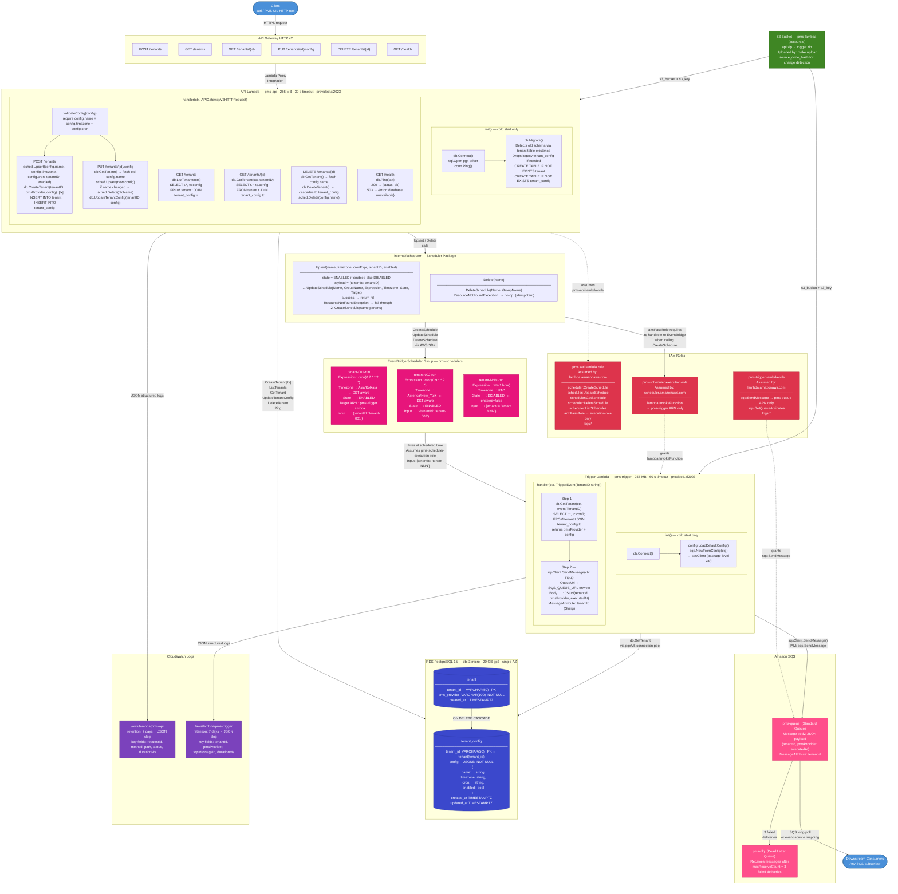

# Multi-Tenant PMS Scheduler — Full Architecture Diagram



---

## Component Reference

### Client
Any HTTP client — curl, Postman, or a PMS front-end. Sends requests to the API Gateway base URL from `terraform output api_endpoint`.

---

### API Gateway HTTP v2
Lambda proxy integration — forwards the full request to the API Lambda and returns its response. No routing logic lives in API Gateway.

---

### API Lambda (`pms-api`)

**`init()` — runs once per cold start:**
- `db.Connect()` — opens PostgreSQL connection via `pgx/v5/stdlib`.
- `db.Migrate()` — detects old schema by checking for the `tenant` table. If absent, drops the legacy `tenant_config` table and creates both new tables. Idempotent on subsequent cold starts.

**`handler(ctx, req)` — runs on every request:**
- Parses method + path, extracts `tenantID` from path segments.
- `validateConfig()` — checks `config.name`, `config.timezone`, and `config.cron` are present.
- For create/update: calls EventBridge **first**, then writes to DB. Rolls back the scheduler on DB failure.
- For delete: fetches `config.name` from DB (to know the scheduler name), then deletes DB row (cascades), then deletes scheduler.

---

### internal/scheduler Package

**`Upsert(name, timezone, cronExpr, tenantID, enabled)`** — the hot-path write.
- Tries `UpdateSchedule` first (no existence check needed).
- Falls back to `CreateSchedule` only on `ResourceNotFoundException`.
- `enabled=false` sets `State=DISABLED` — the scheduler exists but won't fire.
- The cron expression is passed through as-is — no conversion in application code.

**`Delete(name)`** — calls `DeleteSchedule` by the scheduler's name. Ignores `ResourceNotFoundException` (idempotent).

---

### RDS PostgreSQL (`tenant` + `tenant_config`)

Two tables:
- `tenant` — one row per tenant: `tenant_id`, `pms_provider`.
- `tenant_config` — one JSONB config per tenant, foreign-keyed to `tenant` with `ON DELETE CASCADE`.

The `config` JSONB stores `{ name, timezone, cron, enabled }`. `config.name` is the EventBridge scheduler name.

Schedulers are derived resources — they can be deleted and recreated from these tables at any time without data loss.

---

### IAM Roles

**`pms-api-lambda-role`** — used by the API Lambda. Has `iam:PassRole` scoped to `pms-scheduler-execution-role` only. Required so the API Lambda can hand EventBridge a role ARN when calling `CreateSchedule`.

**`pms-scheduler-execution-role`** — assumed by EventBridge Scheduler. Grants only `lambda:InvokeFunction` on the Trigger Lambda ARN.

**`pms-trigger-lambda-role`** — used by the Trigger Lambda. Grants `sqs:SendMessage` scoped to `pms-queue` ARN only.

---

### EventBridge Scheduler Group (`pms-schedulers`)

One scheduler per tenant. Each stores:
- Scheduler name = `config.name` (e.g. `"tenant-001-run"`)
- The cron/rate expression from `config.cron`
- The timezone from `config.timezone` (AWS handles DST automatically)
- The payload `{"tenantId":"tenant-001"}` sent to the Trigger Lambda
- `State: ENABLED` or `DISABLED` based on `config.enabled`

---

### Trigger Lambda (`pms-trigger`)

Receives `{"tenantId":"tenant-001"}` from EventBridge.

1. `db.GetTenant(tenantID)` — loads `pmsProvider` and `config` from the joined tables.
2. Builds SQS payload: `{ tenantId, pmsProvider, executedAt }`.
3. `sqsClient.SendMessage()` — pushes to `pms-queue` with a `tenantId` MessageAttribute for downstream filtering.

---

### Amazon SQS (`pms-queue` + `pms-dlq`)

`pms-queue` buffers trigger output for async downstream processing. `pms-dlq` receives messages that fail 3 deliveries. Monitor `ApproximateNumberOfMessages` on the DLQ — any value above 0 means a tenant's job needs investigation.

---

### CloudWatch Logs

Both Lambdas use Go's `log/slog` with `JSONHandler`. The API Lambda tags every line with `requestId`; the Trigger Lambda tags every line with `tenantId`.

```
Filter API logs for one request:   { $.requestId = "abc-123" }
Filter trigger logs for one tenant: { $.tenantId = "tenant-001" }
```
